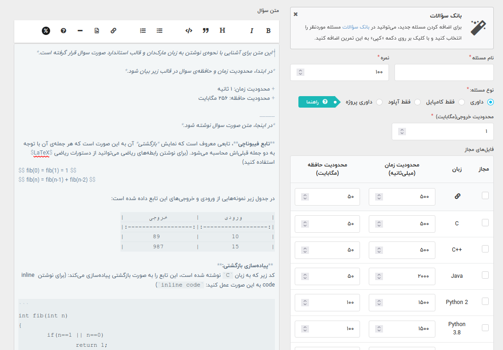
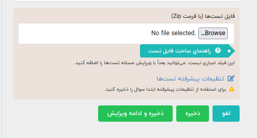
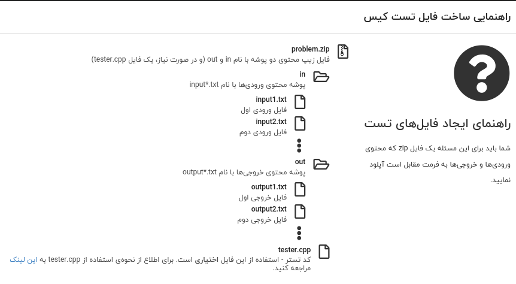

# استفاده از سامانه کوئرا برای طراحی تمرین

## سوالات تمرین

سوالات تمرین فعلا در سامانه quera بارگذاری می‌شوند. استاد یا هدتی‌ای برای ساخت کلاس جدید به کوئرا درخواست می‌دهد و پس از مدتی کلاس تحویل می‌شود. (فرایند ممکن است چند روز طول بکشد)

حالا استاد باید تی‌ای‌ها را با ایمیل اضافه کند، البته هر تی‌ای نیز می‌تواند تی‌ای‌های دیگر را با ایمیل دعوت کنید و سطح دسترسی owner و admin و .. وجود ندارد. فقط دانشجو و admin.

 این سامانه امکان تعریف «سری‌های مختلف تمرین» را می‌دهد که هر سری تمرین شامل چند سوال است. هر سوال صورت جداگانه‌ای دارد که در قالب مارک‌داون فارسی در خود ادیتور کوئرا نوشته می‌شود و امکان آپلود دارد. 

اسکرین‌شات بالا، نمایی از صفحه‌ی ادیت سوال کوئرا است، صورت سوال در قالب مارک‌داون در سمت چپ نوشته می‌شود و تنظیمات آپلود و .. سمت راست قرار می‌گیرد. 

### توضیح قسمت‌های مختلف

+ نام مسئله: همان نامی‌است که در این سوال در تمرین خواهد داشت.

+ نمره: حداکثر نمره قابل کسب از این سوال

+ نوع مسئله: در واقع نوع داوری ارسال‌های دانشجویان است.

  +  حالت «داوری»: در واقع همان مسئله‌های ساده‌ی ورودی خروجی هستند و برنامه از طریق stdin ورودی می‌گیرد و از stdout خروجی می‌دهد. اکثر سوالات درس مبانی کامپیوتر از این نوع خواهند بود.
  + حالت «فقط کامپایل»: این حالت فقط کد دانشجویان آپلود می‌شود و کامپایل می‌شود و نتیجه کامپایل بهشان اعلام می‌شود، این مدل تقریبا برای هیچ مدل مساله‌ای مناسب نیست و خود کوئرا نمره‌ای به ارسال مورد نظر نمی‌دهد.
  + حالت «فقط آپلود»: این حالت امکان ارسال هرنوع فایلی مثل pdf و zip را می‌دهد، این مدل برای سوالاتی که پاسخ تشریحی دارند و دانشجویان pdf ارسال می‌کنند یا مثلا برای پروژه‌هایی که تصحیح ندارند و باید تحویل گرفته شوند مناسب است. این حالت نیز کوئرا به صورت خودکار نمره‌دهی نمی‌کند.

  + حالت «پروژه‌ای»: این مورد مثل سوالات junit برای درس پیشرفته است و در قسمت جداگانه‌ای به آن می‌پردازیم. ممکن است فعلا این گزینه برای شما فعال نباشد.

    

+ محدودیت خروجی: مقدار محتوایی‌است که برنامه مورد نظر می‌تواند چاپ کند (stdout و stderr). از آن‌جا که باید پیش از اجرای برنامه برای این مورد حافظه درنظر گرفت کوئرا زمان طراحی سوال این مورد را از شما می‌پرسد اما درگیر آن نشوید و آن را روی بالاترین (۱۰ مگابایت) مقدار قرار دهید. دقت داشته باشید که ممکن است بنابه جزئیاتی، سولوشن صحیح باشد اما با تنظیم مقدار مجاز خروجی روی مقدار کم، سوال اکسپت نشود بنابراین دقت کافی داشته باشید، مثلا محتوای stderr که در پاسخ قرار نمی‌گیرند اینجا محاسبه می‌شوند.
+ زبان‌ها: بسته به درس مورد نظر می‌توانید زبان را انتخاب کنید مثلا برای درس پیشرفته java و برای درس مبانی cpp و C را انتخاب می‌کنیم. برای سوالاتی که هدف آموزش زبان ندارند (مثلا سوالات الگوریتمی یا مسابقات) می‌توان گزینه اول (بی‌نهایت) را انتخاب کرد تا همه زبان‌ها را شامل شود. توجه کنید که بهتر است برای درس مبانی فقط یک گزینه (مثلا فقط cpp) را در دسترس بگذارید چرا که تقلب‌یابی بین ارسال‌های c و cpp خوب انجام نمی شود.
+ محدودیت زمان: میزان زمانی است که برنامه فرصت دارد تا اجرا شود.
  + (در اکثر جاج‌ها) در هنگام اجرا فقط یک هسته پردازنده در اختیار پروسس قرار می‌گیرد بنابراین نگران multi thread بودن کد نباشید.
  + زمان اجرای یک برنامه واحد در ساعات مختلف شبانه‌روز و لود‌های مختلف سرور یکسان نیست بنابراین حتما دقت داشته باشید که عدد را با حاشیه امنی بیشتر در نظر بگیرید، مثلا اگر سولوشن مورد قبول یک ثانیه‌ای زمان نیاز دارد، حداقل ۱.۵ تا ۲ ثانیه زمان برای اجرای آن در نظر بگیرید.
  + این زمان با زمان اجرا روی سیستم خودتان فاصله دارد چرا که سیستم شما احتمالا فرکانس کاری بیشتر و تسک‌های کم‌تری برای اجرا دارد.
  + برای سوالات مبانی کامپیوتر و برنامه‌نویسی پیش‌رفته، محدودیت زمانی و محدودیت حافظه‌ای سنگینی قائل نمی‌شویم چراکه ملاک نوشتن کد صحیح است نه الگوریتم. (البته در سوالات امتیازی قضیه متفاوت است.)
+ محدودیت حافظه: محدودیت حافظه همان حافظه‌ای است که برنامه می‌تواند اشغال کند که شامل مجموع stack و heap است. البته stack معمولا حجم کم و ثابتی دارد و با پر شدن استک ارور زمان اجرای stack over flow دریافت می‌کنیم و نه memory limit پس عملا در این عدد heap موثر است. البته با توجه به محدودیت‌های کوئرا، برخی زبان‌ها که دارای runtime هستند، حجم اجرایی runtime (مثلا jvm یا python interpreter) نیز در این حجم محاسبه می‌شود. لیست زبان‌هایی که اینطوری هستند باید از خود quera پرسیده شود.

+ فایل تست‌ها یک فایل زیپ برای هر سوال است که شامل دو پوشه‌ی in و out است و تست‌کیس‌ها درون آن قرار می‌گیرد. مطابق تصویر زیر باید برای فایل‌های تست پوشه‌بندی خاصی در نظر گرفت و هر input معادل خود یک output نیز داشته باشد. [این مطلب](https://vrgl.ir/1uezx) را نیز مطالعه کنید.
+ فایل tester.cpp که به شکل اختیاری در این زیپ قرار می‌گیرد، وظیفه این را دارد که برای سوالاتی که جواب صحیح یکتا ندارد (مثلا چاپ یک set بدون ترتیب) خروجی را گرفته و مشخص کند که این تست پاس می‌شود یا نه. [این لینک](https://github.com/mjnaderi/Sharif-Judge/blob/docs/v1.4/tests_structure.md#tester-method) را بخوانید.

### مشکلات در کار با کوئرا

یکسری از مواردی که در کار با کوئرا مشکل داشت را لیست می‌کنم بلکه با اطلاع از آن‌ها پیشگیری‌ها لازم انجام شود:

+ یکسان نبودن نتیجه داوری در ساعت‌های مختلف شبانه‌روز
+ کامپایل‌ارور بی‌دلیل گرفتن از کد گولنگ 
+ ارور بی‌دلیل در اجرای تست‌های پروژه‌ای جاوا (junit)
+ نوشتن اسم سوال در قسمت صورت سوال در مرورگر کروم با کندی همراه است (مثلا ممکن است ۵ ۶ ثانیه طول بکشد و مرورگر هنگ کند.)
+ اگر همزمان یک سوال توسط دونفر ادیت شود، کسی که دیرتر ذخیره کند ادیتش موثر واقع می‌شود و نفر دیگر ادیتش از دست می‌رود، بنابراین حتما دقت داشته باشید که در ادیت سوالات با تیم خود همکاری داشته‌باشید.
+ نداشتن سطح دسترسی: همه اعضای تیم می‌توانند اطلاعات کلاس و تمرین‌ها را تغییر دهند.
+ ادیتور markdown کوئرا مشکلات زیادی دارد:
  + ستاره‌های مربوط به bold و italic گاها عمل نمی‌کنند، حتی ممکن است در preview درست باشند اما وقتی سوال را ذخیره می‌کنید، به جای اینکه متن بولد شود خود ستاره نمایش داده شود. دربرخی حالات مشکل این است که ستاره‌ها به هم یا به کلمه‌ی داخلشان نچسبیده‌اند، مثلا این طوری خوب است: `*salam*` و اینطوری احتمالا مشکل‌زاست: `* salam*`
  + در فایرفاکس با پاک کردن یک خط یا backspace، علامت کرسر شما به جای دیگری می‌پرد.
  + چند باگ دیگر نیز در فایرفاکس وجود دارد بنابراین توصیه میکنم از کروم (یا اگر با گوگل مشکل دارید از chromium برای نوشتن صورت سوال استفاده کنید.)

