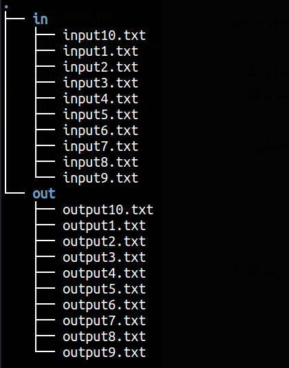

<div dir="rtl">
# قالب تست‌کیس‌های سوالات ورودی خروجی


## نحوه داوری سوالات ورودی خروجی

همانطور که می‌دانید در سوالات ورودی خروجی (مثل سوال‌های درس مبانی و یا الگوریتم) برنامه از طریق دادن ورودی و بررسی خروجی تست می‌شود. 

ورودی برنامه (هر تست کیس) از طریق ورودی استاندارد (stdin) به آن داده می‌شود و خروجی برنامه از خروجی استاندارد (stdout) دریافت می‌شود (actual).

حالا خروجی‌ای که برنامه داده (actual) با خروجی مطابق انتظار (expected) بررسی می‌شود و در صورت یکی بودن تست پاس می‌شود. 

پس در واقع به ازای هر تست‌کیس، ۲ فایل داریم، یک فایل ورودی (متنی که به برنامه داده می‌شود) و یک فایل خروجی (متنی که از برنامه انتظار می‌رود چاپ کند). اما در زمان اجرای برنامه کوئرا با ۳ فایل سر و کار دارد، ورودی برنامه، خروجی مطابق انتظار و خروجی واقعی که این دو را با هم مقایسه می‌کند.

در مقایسه‌ی فایل خروجی و فایل ورودی *خیلی* به whitespace حساس نیست، مثلا آخرِ خط آخر ممکن است `n\` داشته‌ باشد یا نداشته باشد ولی همچنان تست پاس شود. 


دقت داریم که ترتیب چاپ کردن خروجی نیز مهم است، مثلا دو مثال زیر دو خروجی متفاوت هستند.

```
a
b
c
d
```

و

```
b
a
c
d
```


## نحوه قرار دادن همه تست‌کیس‌های یک سوال

برای هر سوال چندین تست‌کیس داریم، یعنی مثلا اگر سوال ۱۰ تست‌‌کیس دارد در واقع ۲۰ فایل داریم که ۱۰ تای آن‌ها ورودی‌های تست‌ها هستند و ۱۰تای دیگر خروجی‌های مورد انتظار تست‌ها.

پوشه‌بندی تست‌کیس‌ها مطابق شکل زیر است، یعنی یک پوشه `in` داریم برای همه‌ی ورودی تست‌کیس ها و یک پوشه `out` داریم برای همه‌ی خروجی تست‌کیس‌ها.

اسم فایل‌ها نیز به شکل `inputXXX.txt` و `outputXXX.txt‍` خواهد بود. 




## محتوای فایل‌های input و output

محتوای فایل‌‌های stdin دقیقا مشابه نمونه‌های ورودی و خروجی‌است که داخل سوال می‌گذاریم و فرمت عجیب و خاصی ندارد. برای مثال می‌توانید به [این فایل](../../images/tests.zip) نگاه کنید.


## ساخت خودکار تست

برای ساخت خودکار تست‌کیس می‌توان از سایت‌هایی که دیتای رندوم می‌سازند استفاده کرد. همچنین برای امر خودکار کردن نوشتن محتوای رندوم با محتوای مشخص‌شده در فایل‌ها و همچنین ساخت خودکار test case و validate کردن آن با چند سولوشن می‌توان از [این برنامه](https://github.com/rsharifnasab/ta_utils/tree/master/test_case_generator) استفاده کرد. 

</div>
